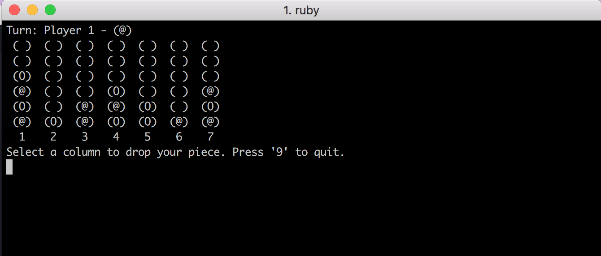

## Connect 4

Connect 4, built as a command-line app, using Ruby. It's a two player local game played with the 1-7 keys.

Built as a self guided, single-day project.

## Instructions

Download this repo to your desktop and navigate to your local folder.

Run: `ruby connect_four.rb`

### Screenshot

